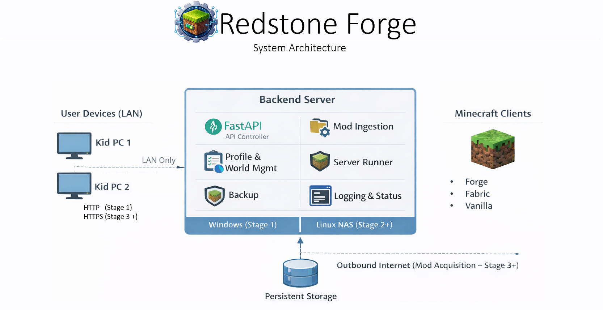

# Architecture

## System Architecture Diagram

><a href="diagrams/system-architecture.png"></a>

This document defines the technical architecture of **Redstone Forge**, a LAN-first, self-hosted Minecraft control panel.

It serves as the authoritative reference for:

- System structure
- Core invariants
- Security posture
- Data and process models
- Migration constraints
- MVP limitations
- Target (v2+) architecture direction

This is a living document and should evolve intentionally, not reactively.


---

# 0. Architectural Philosophy

Redstone Forge is designed to:

- Be LAN-first and secure by default
- Be maintainable long-term
- Avoid Windows-only coupling
- Evolve from MVP to a more capable final product without requiring architectural rewrites
- Keep implementation details separate from architectural truths

Architecture defines what must remain true over time.  
MVP defines what is temporarily limited.

---

# 1. Scope

## 1.1 In Scope (MVP)

- Single Minecraft server instance
- Profile-based mod configuration
- World selection and management
- Web-based UI (LAN only)
- Mod ingestion via Web UI upload
- Automatic backup before configuration changes
- Windows-first deployment

## 1.2 Target Product Direction (v2+)

- Backend-managed mod downloads
- Curated mod catalog
- Provenance tracking and hashing
- Linux NAS hosting as primary deployment target
- Optional desktop launcher client for kid-friendly access
- Optional containerized deployment (Docker)
- Optional single-node orchestration deployment (e.g., k3s/microk8s) for learning purposes
- Potential multi-instance support

## 1.3 Explicit Non-Goals (MVP)

- No public internet exposure
- No WAN access
- No reverse proxy
- No multiple simultaneous server instances
- No automated dependency resolution
- No CurseForge API integration (MVP)

## 1.4 Explicit Non-Goals (v2+)

- Not a public internet-facing hosting platform or multi-tenant control panel
- No WAN/remote access by default (LAN-first remains the default posture)
- No billing, marketplace, or account monetization features
- No guaranteed mod compatibility/dependency resolution engine
- Not designed as a distributed, clustered, or horizontally scalable system
- Containerization and orchestration are optional deployment models, not architectural requirements
- Desktop client is optional; Web UI remains fully supported and authoritative

---

# 2. System Overview

Redstone Forge consists of a backend orchestration service and a browser-based UI.

The backend owns:
- Process control
- File system interaction
- State persistence
- Mod validation
- Backup management

The UI is a control surface only.  
It does not access the filesystem directly.

--- 

## 2.1 Text System Diagram (MVP)

```
[Kid PC Browser]
        |
        | HTTP (LAN only)
        v
[FastAPI Backend - Windows]
        |
        | Subprocess control
        v
[Minecraft Server Process]
        |
        v
[Profiles | Worlds | Mods | Backups | Logs | Database]
```

---

## 2.2 Target System Diagram (v2+ on Linux NAS)

```
[Kid PC Browser]
        |
        | HTTPS (LAN only)
        v
[FastAPI Backend - Linux NAS]
        |
        | Controlled Download + Validation
        v
[Mod Library]
        |
        v
[Minecraft Server Process]
        |
        v
[Persistent Storage]
```

# 3. Core Components

## 3.1 Backend (Server Controller)

Technology:
- Python
- FastAPI

Responsibilities:
- Manage Profiles
- Manage Worlds
- Ingest mod files
- Validate mod files
- Apply mod configurations
- Launch and stop Minecraft server
- Stream logs to UI
- Maintain runtime state
- Trigger backups
- Persist metadata

The backend is the single source of operational truth.

---

## 3.2 Web UI

- Browser-based
- Served from backend host
- LAN-accessible only
- Default: Simple Mode
- Optional: Advanced Mode

Responsibilities:
- Display status
- Upload mods (MVP)
- Select profiles and worlds
- Display logs
- Initiate server start/stop

No client-side filesystem access.

## 3.3 Desktop Client (v2+ Optional)

- Thin client communicating with backend API
- May wrap Web UI (Tauri/Electron) or provide simplified launcher
- No independent server control logic
- No direct filesystem access

# 4. Machine Roles

## 4.1 FastAPI Backend - Windows

- Runs backend
- Runs Minecraft server
- Stores all files locally

## 4.2 Kid PCs

- Access UI
- Upload mods via UI
- Connect to Minecraft server via LAN

## 4.3 Fast API Backend - Linux (Stage 2+)

- Hosts backend
- Hosts Minecraft server
- Centralizes storage
- Replaces FastAPI Backend - Windows host

Architecture must remain OS-agnostic.

---

# 5. Core Architectural Invariants

These rules must remain true across versions:

- Single server instance in MVP; architecture must not prevent future multi-instance support
- Forge and Fabric are completely isolated
- Profiles are version-locked to a specific Minecraft version and loader version (Forge/Fabric)
- Profile validation blocks launch if Minecraft/loader version mismatches are detected
- Profiles define mod configurations
- Worlds are independent but attachable to profiles
- Backup required before mod or world changes
- Backup retention strategy must prevent unbounded disk growth
- LAN-only exposure unless explicitly redesigned
- Uploaded/downloaded files treated as untrusted input
- Profile changes blocked while server is running
- Backend owns process lifecycle
- No hardcoded environment values in code (IPs, hostnames, ports, file paths). All environment-specific values must be configured via config files and/or environment variables with safe defaults.

---

# 6. Mod Ingestion Model

## 6.1 MVP — Web UI Upload

Flow:


``` 
Client Download → Web Upload → Quarantine → Validate → Library → Profile → Backup → Launch 
```

Rules:

- Allow `.jar` only
- Enforce file size limit
- Compute SHA-256 hash
- Store uploads in quarantine first
- Log ingestion events
- Reject invalid files visibly in UI

Storage zones:

```
/uploads/quarantine/
/mods/library/
/profiles/<profile>/mods/
/worlds/
/backups/
/logs/
/database/
```

---

## 6.2 Target Product — Backend-Managed Downloads (v2+)

Flow:

```
UI Selection → Backend Download → Quarantine → Validate → Library → Profile
```

Additional Requirements:

- Allowlist or curated catalog
- Hash validation required
- Provenance tracking
- Reuse same validation pipeline
- Client upload becomes secondary or disabled

---

# 7. State Management

State persistence includes:

- Profile configuration (YAML or JSON)
- World metadata
- Backup metadata
- Active profile tracking
- Server runtime state

Implementation:

- Stage 0 / Stage 1: JSON files for metadata
- Stage 3+: SQLite for structured metadata when complexity increases

State must survive backend restart.

---

# 8. Process Model

The Minecraft server is managed as a subprocess.

Lifecycle:

```
STOPPED
↓
STARTING
↓
RUNNING
↓
STOPPING
↓
STOPPED
```

Rules:

- Graceful shutdown via console command
- Forced termination fallback
- Crash detection
- Prevent configuration changes while running
- Stream logs to UI

---

# 9. Security Model

MVP Security Posture:

- Backend bound to LAN interface only
- No inbound WAN exposure
- No port forwarding
- No reverse proxy
- HTTP only (LAN)
- No authentication (trusted LAN)
- Outbound internet access permitted for mod acquisition:
    - clients download mods locally and upload via LAN Web UI
- Destructive actions require confirmation
- API endpoints must validate input strictly (no blind file writes)
- Uploaded/downloaded files treated as untrusted input
- Logs must not expose sensitive host path details in Simple Mode

Future Enhancements (v2+):

- HTTPS (self-signed or internal cert)
- Local authentication
- Role-based access
- Outbound internet access may be used by the backend for mod acquisition (curated/allowlisted sources)

---

# 10. Networking Assumptions

- Static IP or DHCP reservation recommended
- Access via LAN IP (e.g., http://192.168.x.x:8000)
- No external DNS required
- No reverse proxy required in MVP

---

# 11. Failure Handling

- Detect unexpected server termination
- Surface error state in UI
- Prevent launch if profile invalid
- Prevent profile change while running
- Log all failure events
- Maintain consistent server state machine

---

# 12. Windows → Linux Migration Constraints

To preserve portability:

- Use cross-platform path handling (`pathlib`)
- Avoid hardcoded drive letters
- Avoid PowerShell-specific logic
- Avoid Windows service assumptions
- Design for eventual systemd integration
- Separate config from environment-specific paths

---

# 13. Folder Structure (Planned)

```
/backend
/api
/services
/models
/process
/frontend
/profiles
/worlds
/mods
/uploads
/backups
/logs
/database
```

Structure may evolve but boundaries should remain.

## 13.1 MVP Runtime Storage (Stage 0–1)

Runtime metadata is stored under:

data/
  profiles/
  worlds/
  index/

These files are JSON-based and ignored by version control.

World paths are stored as relative paths and resolved against a configured root.

---

# 14. Future Architecture Expansion

Potential future capabilities:

- Multi-instance server support
- Instance-level resource isolation and configurable limits (CPU/RAM) required for multi-instance support
- Curated mod catalog
- CurseForge import integration
- Optional authentication layer
- Linux-native deployment
- Optional Docker-based deployment (Compose)
- Optional single-node Kubernetes deployment (educational/stretch goal)
- Desktop launcher client that integrates with backend API

These are additive features and must not violate core architectural invariants.

---

# Summary

Redstone Forge is designed as a:

- LAN-first
- Secure-by-default
- Single-instance orchestration system
- With controlled mod ingestion
- And a clear migration path to Linux NAS

The architecture defines stable boundaries and invariants while allowing the implementation to evolve from MVP to a more capable final product without requiring structural rewrites.